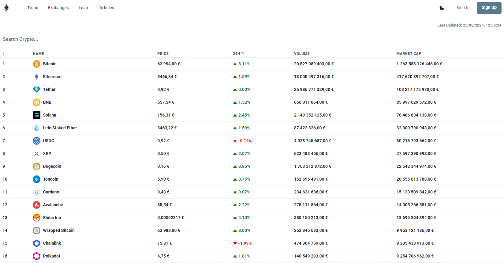
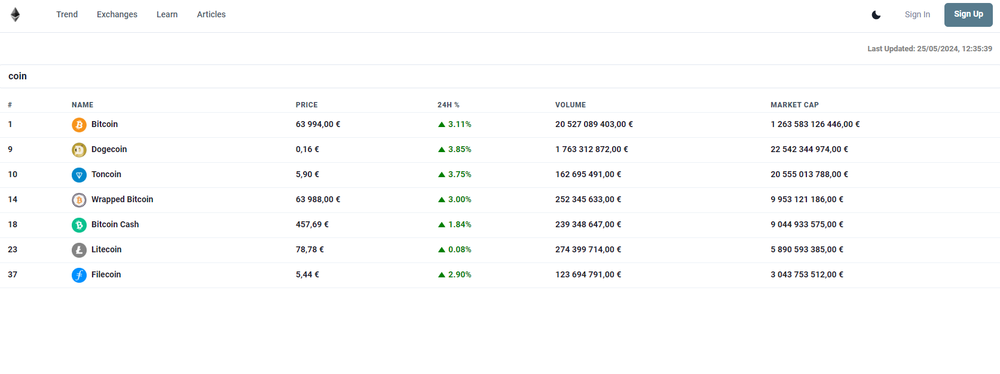
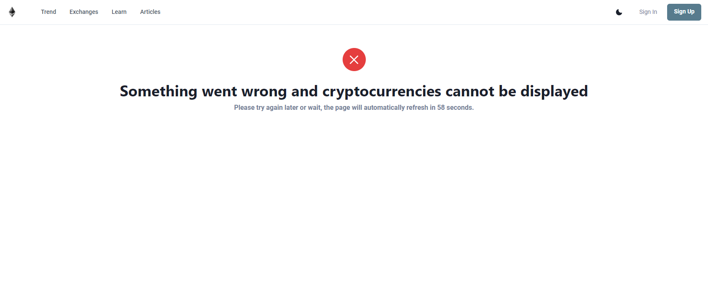

# CryptoTracker App - TechWave Entertainment Technical Assessment

A simple web application that permits users to monitor cryptocurrency prices and market details live.

## Characteristics

- A list of cryptocurrencies together with their prevailing prices, market caps, price changes in price over 24 hours can be accessed.
- Cryptocurrencies can be sorted by different metrics including name, price, market cap, and 24-hour price change.
- Specific cryptocurrencies can be searched by name using the search bar.
- Data refresh happens automatically every minute, keeping the information updated.
- Error handling is put in place for situations where cryptocurrency data cannot be retrieved (normally for too many request in the API).

## Technologies Used

- React.js with Typescript.
- Chakra UI.
- CoinGecko API.
- Axios.
- React Router DOM.
- React Icons.
- HTML.
- CSS.

 =============================================================================
|                                                                             |  
|    npm i @types/react-router-dom                                            |
|    npm i axios                                                              |
|    npm i @chakra-ui/react @emotion/react @emotion/styled framer-motion      |
|    npm i @chakra-u i/icons                                                  |
|    npm i react-icons                                                        | 
|                                                                             |
 =============================================================================

## Getting Started

Run this application on your machine by following these steps:

- Clone this repository to your local contraption.
- Go to the project directory.
- Start installing dependencies by running `npm install`.
- Run the server with  `npm start`.
- Open the app in your browser by opening [http://localhost:3000].

## Usage

At its inception, the application unveils an inventory of cryptocurrencies with their corresponding price, market capitalizations, and 24-hour fluctuations.
Sort the cryptocurrencies by the selected metric when you click on the column headers.
Filter cryptocurrencies by name through the search bar.
The information updates itself every minute.
In case there is an issue obtaining cryptocurrency data, a countdown will be shown with the error message; this indicates when the page will refresh.

## Screenshots

