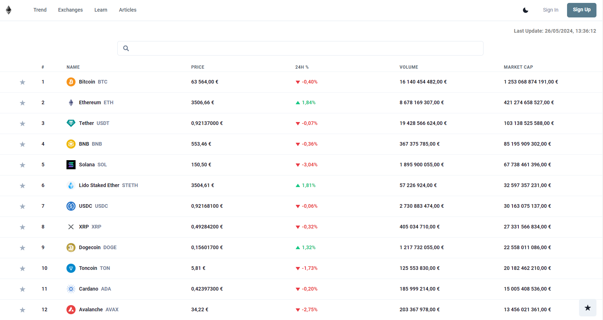
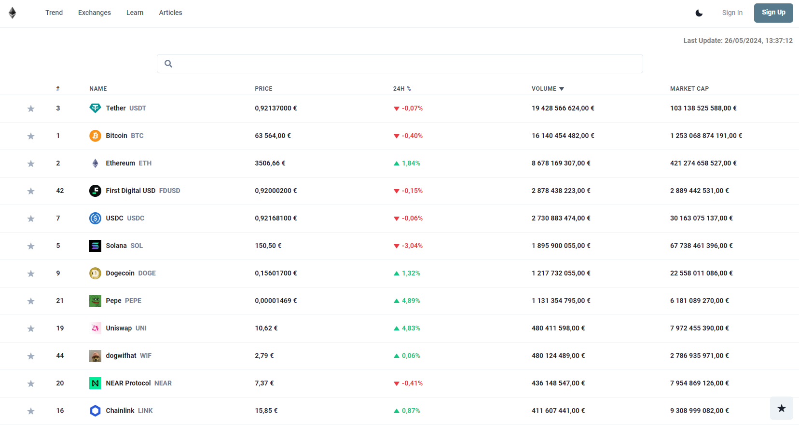
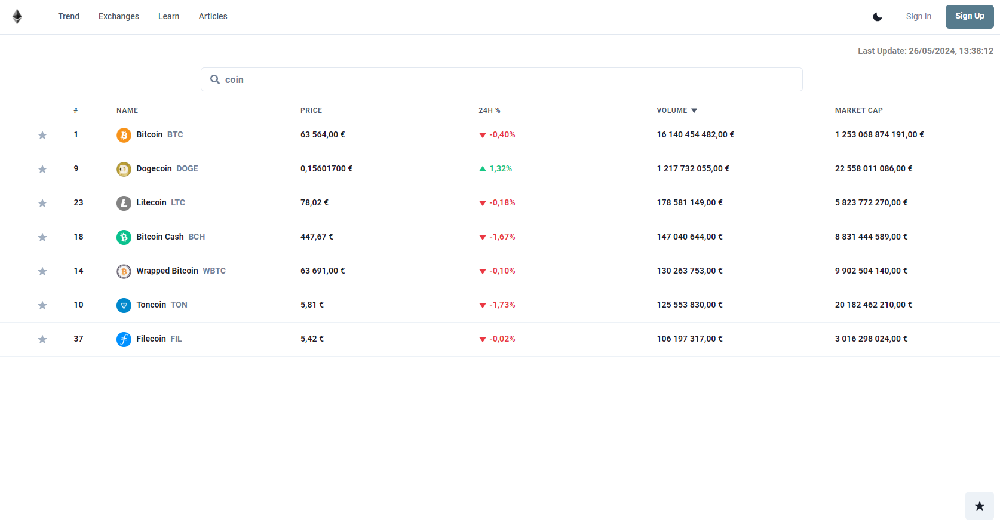
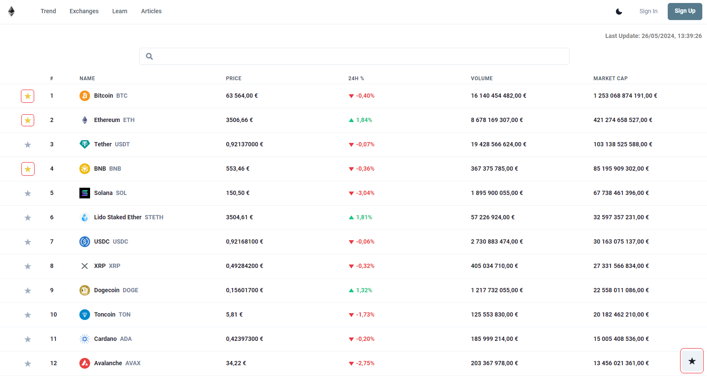
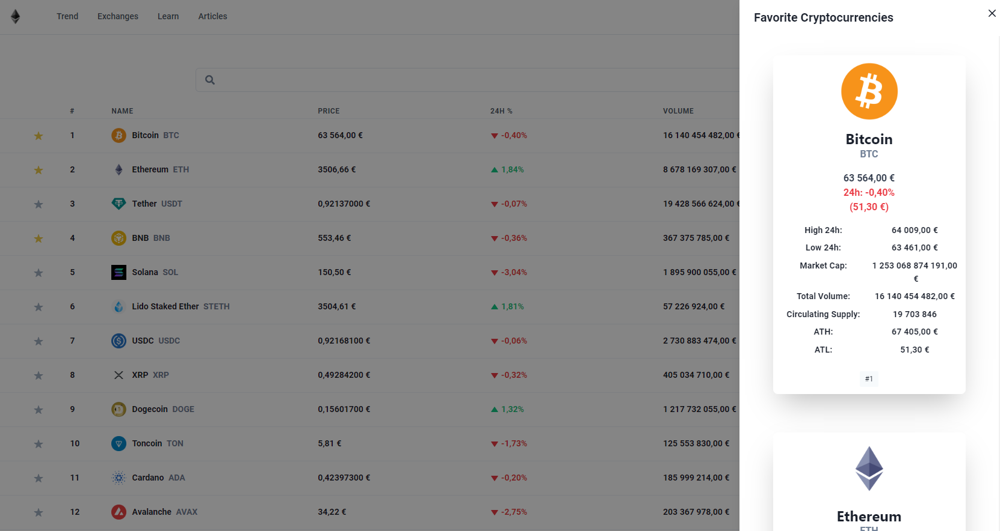
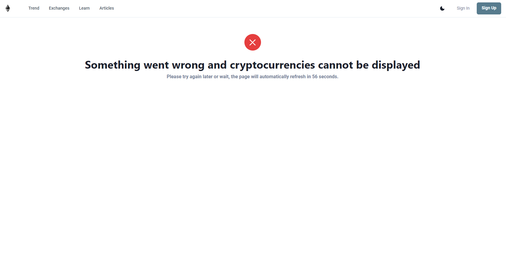

# CryptoTracker App - TechWave Entertainment Technical Assessment

A simple web application that permits users to monitor cryptocurrency prices and market details live.

## Characteristics

- A list of cryptocurrencies together with their prevailing prices, market caps, price changes in price over 24 hours can be accessed.
- Cryptocurrencies can be sorted by different metrics including name, price, market cap, and 24-hour price change.
- Specific cryptocurrencies can be searched by name using the search bar.
- Data refresh happens automatically every minute, keeping the information updated.
- Error handling is put in place for situations where cryptocurrency data cannot be retrieved (normally for too many request in the API).
- Users can add cryptocurrencies to favorite watchlist.
- The user can access their favorite cryptocurrencies to see details about them such as Circulating Supply, ATH, ATL and more details about price changes in the last 24 hours.
- Navbar is only for aesthetic, buttons aren't functional, `except for the lighting/theme change button`.

## Technologies Used

- React.js with Typescript.
- Chakra UI.
- CoinGecko API.
- Axios.
- React Icons.
- HTML.
- CSS.

## Getting Started

Run this application on your machine by following these steps:

- Clone this repository to your local contraption.
- Go to the project directory.
- Start installing dependencies by running `npm install`.
- Run the server with  `npm start`.
- Open the app in your browser by opening [http://localhost:3000].

## Usage + Screenshots

- Upon its launch, the app displays an inventory of cryptocurrencies with their corresponding prices, market capitalizations, and 24-hour fluctuations.

- The information updates itself every minute.

- Sort the cryptocurrencies by the selected metric when you click on the column headers.

- Filter cryptocurrencies by name through the search bar.

- Click on the star in the first column of the table to send that cryptocurrency to your favorite watchlist, cryptocurrencies on your favorite watchlist have a filled star.

- The favorites list can be accessed by clicking the floating star button in the bottom right corner of the page, then your list will be opened.

- In case there is an issue obtaining cryptocurrency data, a countdown will be shown with the error message, this indicates when the page will refresh automatically.

## Demo

The demo can be accessed through this link: `https://crytptocurrency-tracker.netlify.app`
